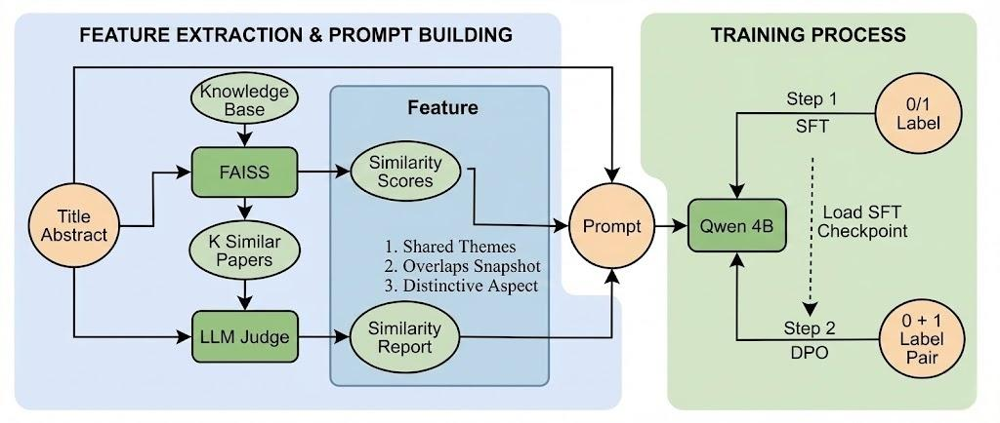
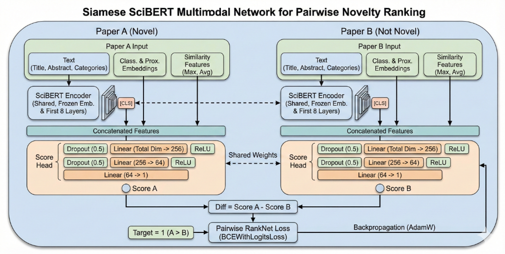
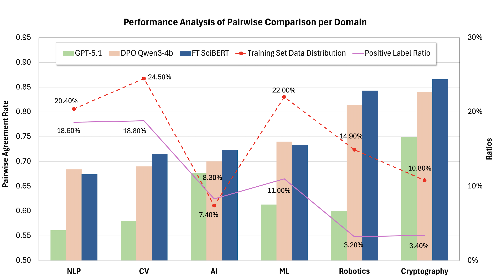

# NoveltyRank

<div align="center">
  
  <br>
  <h3>
    <a href="https://novelty-rank.vercel.app/">
      🚀 Discover the Most Innovative Papers »
    </a>
  </h3>
</div>


## Overview

NoveltyRank evaluates the conceptual novelty of AI research papers using two complementary task formulations and three benchmark modeling approaches.

We implement:
1. Binary Novelty Classification – predicting whether a single paper is novel.
2. Pairwise Novelty Comparison – determining which of two papers is more novel.

To benchmark these tasks across different modeling scales, we compare three methods:
- GPT-5.1 (zero-shot) as a large-scale frontier baseline
- Qwen3-4B (SFT + DPO fine-tuning) as a mid-sized, task-adapted LLM
- SciBERT (fine-tuned and Siamese variants) as an efficient domain-specific encoder

This framework highlights how task formulation and model adaptation influence novelty estimation, with pairwise comparison and fine-tuned models providing the most reliable performance.


This project is part of **Stanford University’s CS230: Deep Learning (Fall 2025)**.  
Dataset hosted at: [Hugging Face – novelty-ranked-preprints](https://huggingface.co/datasets/JasonYan777/novelty-ranked-preprints/viewer/default/train?sort%5Bcolumn%5D=novelty_score&sort%5Bdirection%5D=desc&views%5B%5D=train&row=5073)

---

## Methodology & Results

### Qwen-4B Architecture with Similarity Features


### Siamese SciBERT Architecture



### Binary Novelty Classification Performance

| Model                | Acc      | Prec      | Rec    | F1       |
|----------------------|----------|-----------|--------|----------|
| **GPT-5.1**          | 24.2%    | 12.0%     | 98.6%  | 21.5%    |
| **SFT Qwen3-4b**     | 62.7%    | 19.4%     | 63.2%  | 29.7%    |
| **DPO Qwen3-4b**     | 61.2%    | 20.5%     | 73.5%  | 32.1%    |
| **SciBERT**          | 74.4%    | 18.7%     | 31.3%  | 23.4%    |

### Pair-wise Comparison Agreement Rate

| Model                | cs.AI | cs.CL | cs.CR | cs.CV | cs.LG | cs.RO | COMBINED |
|----------------------|-------|-------|-------|-------|-------|-------|----------|
| **GPT-5.1**          | 67.7% | 56.1% | 75.0% | 58.0% | 61.3% | 60.0% | 58.3%    |
| **DPO Qwen3-4b**     | 70.0% | 68.4% | 84.0% | 69.0% | 74.0% | 81.4% | 74.1%    |
| **SciBERT**          | 72.3% | 67.4% | 86.6% | 71.5% | 73.3% | 84.3% | 75.3%    |
  
<div align="center">
  
  <br>
  <em>Figure: Domain Distribution of the NoveltyRank Dataset</em>
</div>

---

## Installation

1. **Create a Conda environment**

   ```bash
   conda create -n noveltyrank python=3.11
   conda activate noveltyrank
   ```

2. **Install dependencies**

   ```bash
   pip install tinker
   pip install git+https://github.com/thinking-machines-lab/tinker-cookbook.git
   ```

3. **Clone and install the repository**

   ```bash
   git clone git@github.com:ZhengxuYan/NoveltyRank.git
   cd NoveltyRank
   pip install -r requirements.txt
   ```

4. **create .env file**
   Please create a `.env` file in the root directory and add the following lines with your respective API tokens:
   ```
   HUGGINGFACEHUB_API_TOKEN=your_hugging_face_token_here
   WANDB_API_KEY=your_wandb_api_key_here
   TINKER_API_KEY=your_tinker_api_key_here
   ```
   If you don't have these tokens, please sign up on the respective platforms to obtain them.

---
### Node.js / Frontend Dependency Management

If you need to modify or run the frontend (under the `web/` directory), install Node.js dependencies by running:
```bash
cd web
npm install
# or
yarn install
```
All packages will be installed into the `node_modules/` folder, which is included in `.gitignore` and should not be committed to the repository. Only `package.json` and lock files (`package-lock.json` or `yarn.lock`) are needed for reproducibility.

If you do not need to modify or run the frontend, you can skip this step entirely.
---

## Code Structure


```
NoveltyRank/
│
├── data_cache/                # Preprocessed and cached datasets (classification/similarity-aware) - gitignored
│
├── results/                   # Training outputs, evaluation results, model checkpoints - gitignored
│
├── embedding/
│   ├── embeddings.py          # SPECTER2 embedding generation
│   ├── similarity.py          # FAISS similarity computation
│   └── similiarity_report/    # Scripts for generating/managing similarity reports
│
├── models/
│   ├── Qwen_4B/               # Qwen model code and environment (e.g. sft_env.py, dpo_env.py, data_preparation.py)
│   └── scibert_multimodal/    # SciBERT multimodal model and configs
│
├── scripts/
│   ├── Qwen_4B/               # Qwen SFT/DPO training & evaluation scripts (sft.py, dpo.py, test_*.py)
│   ├── openai/                # Frontier/OpenAI baseline evaluation scripts
│   └── Sci_BERT/              # SciBERT training and analysis scripts
│
├── utils/
│   ├── create_hf_dataset.py   # HuggingFace dataset creation
│   ├── create_novelty_dataset.py # NoveltyRank custom dataset builder
│   ├── push_to_huggingface.py # Upload utilities
│   └── other helper scripts
│
├── web/                       # Frontend pages and config
│
├── README.md
└── requirements.txt
```

## Usage

### 1. Scraping Papers

Collect papers from ArXiv and conferences:

```bash
# ArXiv papers
cd scrapers/arxiv_scraper
scrapy crawl arxiv -o results/arxiv_results.csv

# Conference papers (OpenReview)
cd scrapers/conference_scraper
python scrape_openreview.py --conference ICLR --start-year 2024 --end-year 2025
```

### 2. Generating Embeddings

Generate SPECTER2 embeddings for the collected papers:

```bash
cd embedding
python embeddings.py --dataset JasonYan777/novelty-rank-dataset --batch-size 8
```

This creates both classification and proximity embeddings for each paper.

### 3. Computing Similarities

Compute FAISS indices and nearest neighbors based on the embeddings:

```bash
python similarity.py
```

- Writes FAISS indices and caches per category.
- Emits the top-10 similar papers (and cosine scores) for every paper.


### 4. Model Training

#### Qwen3-4B SFT and DPO Fine-Tuning

Classification SFT (with similarity-aware data)
```bash
python scripts/Qwen_4B/train/sft.py \
  data_variant=sim \
  log_path=results/aligned_sft_classification_sim \
  wandb_name=aligned_sft_classification_sim \
  learning_rate=2e-5 \
  batch_size=256 \
  num_epochs=12 \
  eval_every=250 \
  save_every=250
```

Classification DPO (warm-start from SFT checkpoint, with similarity-aware data)
```bash
python scripts/Qwen_4B/train/dpo.py \
  env_config.dpo_mode=classification \
  env_config.data_variant=sim \
  env_config.load_checkpoint_path=tinker://b5ca8513-464a-563b-b0e0-6e3a26fe90f9:train:0/weights/final \
  env_config.log_path=results/aligned_dpo_classification_sim \
  env_config.wandb_name=aligned_dpo_classification_sim \
  env_config.learning_rate=1e-6 \
  env_config.batch_size=128 \
  env_config.num_epochs=1 \
  env_config.eval_every=100 \
  env_config.save_every=100
```

Comparison SFT (base data without similarity-aware data)
```bash
python scripts/Qwen_4B/train/sft.py \
  data_variant=base \
  sft_task=comparison \
  log_path=results/aligned_sft_comparison_base \
  wandb_name=aligned_sft_comparison_base \
  learning_rate=3e-5 \
  batch_size=64 \
  num_epochs=10 \
  eval_every=40 \
  save_every=40
```

Comparison DPO (warm-start from comparison SFT, base data without similarity-aware data)
```bash
python scripts/Qwen_4B/train/dpo.py \
  env_config.dpo_mode=comparison \
  env_config.data_variant=base \
  env_config.load_checkpoint_path=tinker://da6dc40b-ab62-5509-9a69-4691d2b5e044:train:0/weights/final \
  env_config.log_path=results/aligned_dpo_comparison_base \
  env_config.wandb_name=aligned_dpo_comparison_base \
  env_config.learning_rate=1.5e-6 \
  env_config.batch_size=64 \
  env_config.num_epochs=4 \
  env_config.eval_every=50 \
  env_config.save_every=50
```

**Description**
- These scripts fine-tune `Qwen/Qwen3-4B-Instruct-2507` on the NoveltyRank dataset using supervised learning and DPO where applicable.
- We rely on the Tinker Cookbook for data loading, distributed training, and other low-level details so you can focus on configuration and hyperparameters.
- All runs write checkpoints and W&B logs into the specified `log_path`. Use unique directories when launching multiple experiments in parallel.

#### Qwen3-4B Evaluations

Quickly sanity-check the latest checkpoints with the lightweight evaluation scripts:

```bash

# Classification accuracy on whole dataset with similarity report
python scripts/Qwen_4B/test/test_classification.py \
  --category WHOLE_DATASET \
  --model-path tinker://aa417c54-d5ee-5b99-a04e-66a1f4b40a51:train:0/sampler_weights/000900 \
  --data_variant sim

# Comparison accuracy on whole dataset without similarity report
python scripts/Qwen_4B/test/test_comparison.py \
  --category WHOLE_DATASET \
  --model-path tinker://a69d7dfe-9693-5eeb-9dea-b065b39b13e0:train:0/sampler_weights/000700 \
  --data_variant base
```

Key flags:
- `--category`: Choose a category-specific cache if present (e.g. `CS_CV`, `CS_AI`). If not provided, the scripts fall back to the whole-dataset cache.
- `--model-name`: Base model registered with Tinker (defaults to the production Qwen3-4B checkpoint).
- `--model-path`: Tinker checkpoint URI. Pass an empty string to fall back to the base model.
- `--temperature`: Sampling temperature (default `0.0` for deterministic decoding).
- `--max-tokens`: Maximum generated tokens (`10` for classification, `512` for comparison).
- `--limit`: Caps the number of evaluation examples (useful for quick smoke tests).
- `--data-variant`: Choose between `base` (no similarity features) and `sim` (with similarity features) datasets.


#### SciBERT and Siamese SciBERT Training

- Classification (SciBERT Multimodal)
  ```bash
  python scripts/Sci_BERT/ft_scibert.py \
    --dataset JasonYan777/novelty-rank-with-similarities \
    --batch-size 32 \
    --learning-rate 2e-5 \
    --epochs 5
  ```

- Comparison (Siamese SciBERT)

  ```bash
  python scripts/siamese_scibert/train_pairwise.py
  ```

#### SciBERT Evaluations

- Siamese SciBERT Agreement Rate
  ```bash
  python scripts/siamese_scibert/evaluate_agreement.py
  ```

#### OpenAI Baseline Evaluation

Evaluates frontier models (e.g., GPT-5.1) on the pairwise novelty task using the `bespokelabs-curator` library.
```bash
python scripts/openai/test_frontier_novelty_classification.py
```
```bash
python scripts/openai/test_frontier_novelty_comparison.py
```
